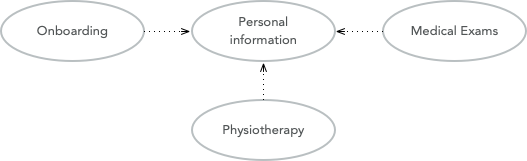

= Domain Driven Design & Microservices for Architects

== Links

- https://vaadin.com/learn/tutorials/ddd[Domain Driven Design Crash Course]
- https://www.baeldung.com/java-modules-ddd-bounded-contexts[DDD Bounded Contexts in Java Modules]
- https://github.com/acloudfan/MSFA-ACME-Sales-v1.0.git[Sales]
- https://github.com/acloudfan/MSFA-ACME-Products-v1.0.git[Products]

. #_Software Architect makes high-level design choices based on their experience, *knowledge & understanding* of the software models, standards, tools and techiniques_#

== DDD Part 1: Strategic Domain-Driven Design

#_Domain-Driven Design_# (DDD) has been around since Eric Evans published his book about the subject in 2003, this content is very much based on the books Domain-Driven Design: Tackling Complexity in the Heart of Software by Eric Evans and Implementing Domain-Driven Design by Vaughn Vernon

=== What is a Domain

In case of domain-drive design can be represented by an "activity", this activity whatever an organization does and knowledge is how the organization does it, we have also the environment in which the organization conducts its activities to the domain concept.

==== Subdomains

Domain is a very broad and abstract concept, to make it more concrete and realistic, we need split it up into smaller parts called _subdomains_ but finding these subdomains is not always an easy thing to do... lets classify subdomain in categories such as:

. Core domains
. Supporting subdomains
. Generic subdomains

#_A core domain is what makes an organization special and different from other organizations_#.
An organization cannot succeed (or even exist) without being perfect in their core domain.
Because the core domain is so important, it should receive the highest priority, the biggest effort and the best developers.
For smaller domains you may only identify a single core domain, larger domains may have more than one.
You should be prepared to implement the features of the core domain from scratch

#_A supporting subdomain is a subdomain that is necessary for the organization to succeed_#, but it does not fall into the core domain category.
It is not generic either because #_it still requires some level of specialization_# for the organization in question.
You may be able to start with an existing solution and tweak it or extend it to your specific needs.

#_A generic subdomain is a subdomain that does not contain anything special to the organization but is still needed for the overall solution to work.
#You can save a lot of time and work by trying to use off-the-shelf software for your generic subdomains#.
A typical example would be user identity management.

It is worth noting that the same subdomain can fall into different categories depending on what the organization does.
For a company that specializes in identity management, identity management is a core domain.
However, for a company that specializes in customer relations management, identity management is a generic subdomain.

Finally, it is worth pointing out that all subdomains are important to the overall solution regardless of the category in which they fall.
They do, however, require different amounts of effort and may also have different requirements of quality and completeness.

- Example

Let’s say we are building an EMR (Electronic Medical Records) system for smaller clinics.
We have identified the following subdomains:

    Patient Records for managing patient medical records (personal information, medical history, etc.).

    Lab for ordering lab tests and managing test results.

    Scheduling for scheduling appointments.

    File Archive for storing and managing files that are attached to the patient records (such as different documents, X-ray pictures, scanned paper documents).

    Identity Management for making sure the right people have access to the right information.

image::architecture/thumb/subdomains.png[]

To be able to create software for a domain, you need a way of describing the domain and #having a relational data model or something similar is not enough#, you need to be able to describe not only things and their relations but also the dynamics such as events, processes, business invariants, how things change over time, and so on, You need to be able to discuss and reason about the domain with both your fellow developers and also the domain experts.
What you need is a _ubiquitous language_.
The ubiquitous language is a language that is consistently used by both domain experts and developers to describe and discuss the domain, you can document the ubiquitous language in various ways.
A good starting point is to create a glossary of terms.
Business processes can be described graphically using e.g. swim-lane diagrams and flow charts.
UML can be used to describe the relationship between things and state diagrams to describe how state changes as different things move through different processes.
If you can easily explain a business concept or process using the language, it means you are on the right track.
If you, on the other hand, find your self struggling to explain something, you are most likely missing something from the language and thereby also from your domain model.
When this happens, you should grab a domain expert and go looking for the missing pieces.
Instead of trying to find the Big Unified Model, we choose to accept the facts and instead introduce something called bounded contexts.
A bounded context is a distinct part of the domain in which a particular subset or dialect of the ubiquitous language is consistent at all times, in other words, we are applying divide and conquer and splitting the domain model up into smaller, more or less independent models with clearly defined boundaries.
Every bounded context has its own name and this name is a part of the ubiquitous language.
We can to think about bounded contexts as separate systems (e.g. separate executable JARs or deployable WARs in the Java world).
#A perfect real-world example of this is microservices, where each microservice can be considered its own bounded context.#

If we are using the EMR as example we can describe such: The system supports services for both #doctor appointments# and #physiotherapy#.
In addition, there is a separate #onboarding# process for new #patients# where they are interviewed, photographed and given an initial assessment.
This leads to the following bounded contexts within the core domain:

. Personal information for managing the patient’s personal information (name, address, financial information, medical background, etc).
. Onboarding for introducing new patients into the system.
. Medical Exams used by doctors when examining and treating the patient.
. Physiotherapy used by physiotherapists when examining and treating the patient.

- Relationships Between Contexts

In a non-trivial system, very few (if any) bounded contexts are completely independent, #Most contexts will have some kind of relationship with other contexts.
Identifying these relationships is of importance not only technically (how will the systems technically communicate with each other) but also to how they are developed (how will the teams that develop the systems communicate with each other)#

Under the contexts Maps and Integration Patterns we have some questions

. Where are the context boundaries?
. How are the contexts going to communicate technically?
. How are we going to map between the contexts' domain models (i.e. how are we translating from one ubiquitous language to another)?
. How are we going to guard against unwanted or problematic changes occurring upstream?
. How are we going to avoid causing trouble for downstream contexts?

== DDD Part 2. Tactical Domain-Driven Design

. Compared to strategic domain-driven design, tactical design is much more hands-on and closer to the actual code. Strategic design deals with abstract wholes whereas tactical design deals with classes and modules, The purpose of tactical design is to refine the domain model to a stage where it can be converted into working code, design is an iterative process and so it makes sense to combine strategic and tactical design.
. One of the most important concepts in tactical DDD is the *value object.*, value objects should always be made _immutable_, instead of changing the state of the value object, you replace it with a new instance. For complex value objects, consider using the builder or essence pattern.
. Value objects are not only containers of data - they can also contain business logic. The fact that the value objects are also immutable makes the business operations both thread-safe and side-effect free This is one of the reasons I like value objects so much and why you should try to model as many of your domain concepts as possible as value objects. Also, try to make the value objects as small and as coherent as possible - this makes them easier to maintain and reuse

[source,java]
----
class Currency {
    private final Money balance; // bring the context to the value
}

class Money implements Serializable, Comparable<Money> {
    
    private BigDecimal amount;

    Money add(Money other) {}

}

enum Currency {
    USD, BRL
}

class Email {
    @Email
    private final String address;
}

@Builder
@AllArgsConstructor
class StreetAddress implements Serializable, Comparble<StreetAddress> {
    final String city;
    final String streetAddress;

    final Country country;
    final PostalCode postalCode;
}

----

. The second important concept in tactical DDD and the sibling to value objects is the *entity*. An entity is an object whose identity is of importance. As opposed to value objects, entities are mutable. However, that does not mean you should create setter methods for every property

[source,java]
----
class Person {
    final PersonId personId; // VO is used fot the Entity ID
    final PersonName personName;
    final StreetAddress address;
}

class PersonId {
    final String indentifer;
}
----